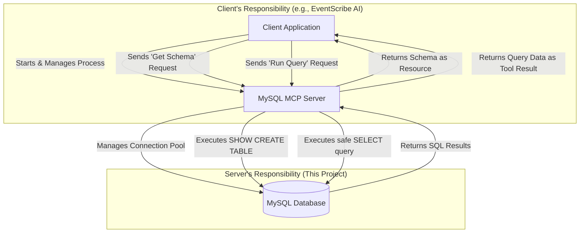

# General-Purpose MySQL MCP Server

[](https://www.npmjs.copackage/@abeqqal_marouane/mysql-mcp-server)
[](https://wwtypescriptlang.org/)
[](https://modelcontextprotocol.io/)
[](https://www.mysql.com/
This repository contains a general-purpose, secure, and efficient **Model Context Protocol (MCP)** server for MySQL databases. Iacts as a secure bridge, allowing AI agents and applications (MCP Clients) to interact with any MySQL database without needindirect credentials
This server is designed to be a standalone, reusable npm package. It was originally developed for the [EventScribe AI](https:github.com/AbeqqalMarouane/PromptEnhancing_UsingMCP) project but can be used by any MCP-compatible client
## ✨ Key Feature
- **Dynamic Schema Discovery**: Exposes the full database schema as an MCP `resource`, allowing AI agents to understand thstructure of any database it connects to.
- **Secure Read-Only Querying**: Provides a `read_only_query` MCP `tool` that strictly enforces `SELECT` statements, preventinany destructive operations and protecting your data.
- **High Performance**: Uses a MySQL connection pool for efficient, high-concurrency database interactions suitable foproduction environments.
- **Simple Configuration**: Uses a clean `.env` file in the user's home directory, keeping credentials secure and separate froclient applications.
- **Graceful Shutdown**: Includes logic to cleanly close database connections when the server process is terminated
## 🏗️ Architecture: The Server's Rol
This MCP server is the "Data Layer" in a modern agentic architecture. The client (e.g., a Next.js application) orchestrates thworkflow, while this server is the only component with direct access to the database

## 🚀 Installation & Usage Guide for Users
This guide explains how to install and use the server as an npm package. For instructions on how to contribute to the code, sethe "For Developers" section below
### Step 1: Installation
In your client project (e.g., your Next.js app), install the package from npm
```bash
npm install @abeqqal_marouane/mysql-mcp-server
```
### Step 2: Configuration for Users
This server requires a configuration file to securely connect to your database
Create a dedicated folder in your user home directory
- On Windows (PowerShell): `mkdir ~/.mysql-mcp-server`
- On macOS/Linux (Terminal): `mkdir -p ~/.mysql-mcp-server
Create the configuration file. Inside that new folder, create a file named `config.env`
Add your database credentials to the `config.env` file with the following format
```env
# ~/.mysql-mcp-server/config.en
DB_HOST=localhost
DB_USER=your_mysql_user
DB_PASSWORD=your_mysql_password
DB_NAME=your_database_name
DB_PORT=3306
```
The server will automatically find and load this file every time it starts
### Step 3: Usage
This server is designed to be launched and controlled by an MCP client
#### In an MCP Client Application (e.g., Next.js)
Configure your client's `StdioClientTransport` to use the command provided by this package. Note that you no longer need filpaths or `npm start`
```javascript
// In your client application code
import { StdioClientTransport } from "@modelcontextprotocol/sdk/client/stdio.js"
const transport = new StdioClientTransport({
  command: "mysql-mcp-server",
  args: []
})
// ... then connect your MCP client to this transport.
```
#### For Quick Testing with MCP Inspector
You can test the server directly from your terminal, without needing to clone the repository
First, install the package globally to make the command available everywhere
```bash
npm install -g @abeqqal_marouane/mysql-mcp-server
```
Make sure you have created the `config.env` file as described in the "Configuration" step above
Run the server with the Inspector
```bash
npx -- @modelcontextprotocol/inspector mysql-mcp-server
```
## 📖 Exposed MCP Capabilities
This server exposes two primary capabilities to any connected client
### Resource: schema
- **URI**: `mysql://schemas`
- **Description**: Returns the full `CREATE TABLE` SQL statements for all tables in the connected database. This allows an Aagent to learn the complete structure of the database.
- **Usage (in a client)**
```typescript
mcpClient.readResource({ uri: "mysql://schemas" })
```
### Tool: read_only_query
- **Name**: `read_only_query`
- **Description**: Executes a SQL query against the database.
- **Input Schema**: `{ sql: string }`
- **Security**: The tool contains a vital security check. It will only execute queries that begin with `SELECT`. Any othecommand (UPDATE, DELETE, INSERT, DROP, etc.) will be rejected with an error.
- **Usage (in a client)**
```typescript
mcpClient.callTool({
  name: "read_only_query",
  arguments: { sql: "SELECT * FROM events LIMIT 10" }
});
```
## 👨‍💻 For Developers / Contributing
If you want to modify or contribute to this server, follow these steps
### Clone the repository
```bash
git clone https://github.com/AbeqqalMarouane/MySQL-MCP-Server.git
cd MySQL-MCP-Server
```
### Install dependencies
```bash
npm install
```
### Create a local `.env` file for development
As described in the Configuration section
### Build the TypeScript code
```bash
npm run build
```
Contributions are welcome! Please feel free to fork the repository, make your changes, and submit a pull request
## 📄 License
This project is licensed under the MIT License.